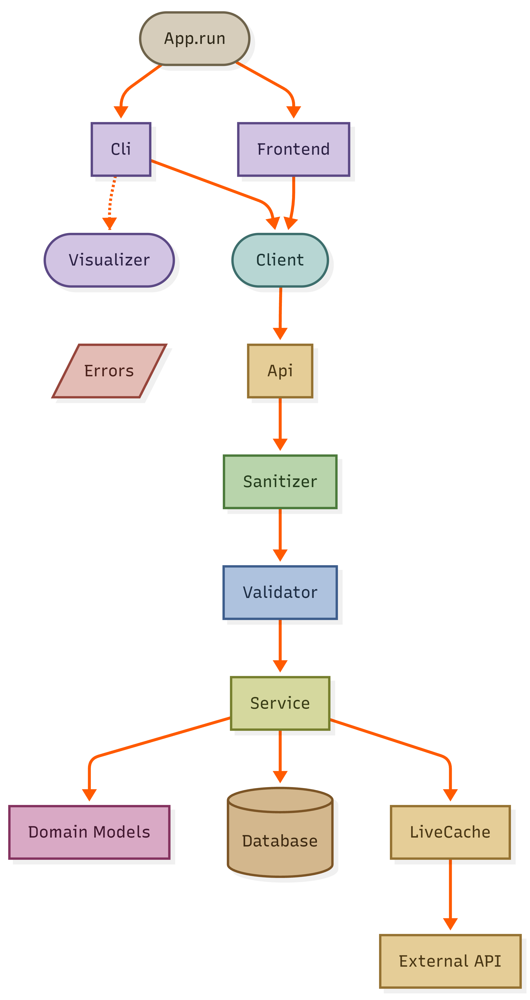
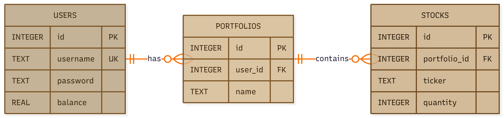
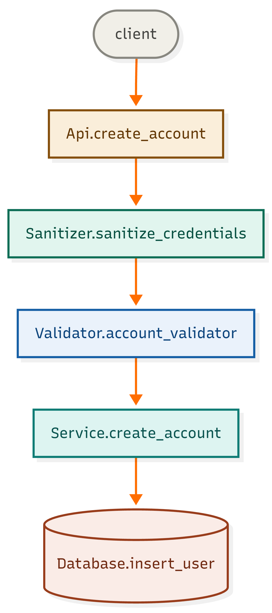
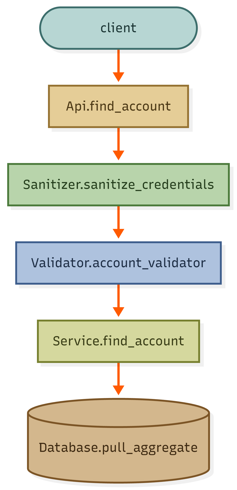
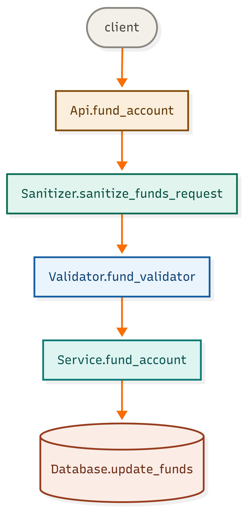
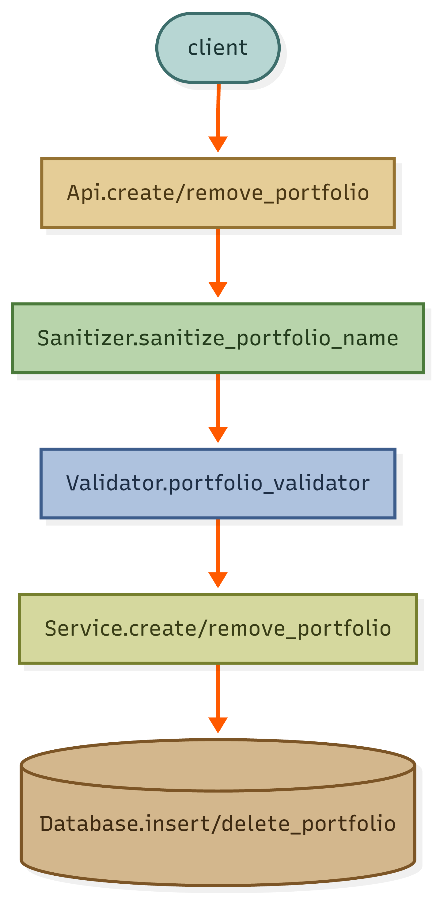
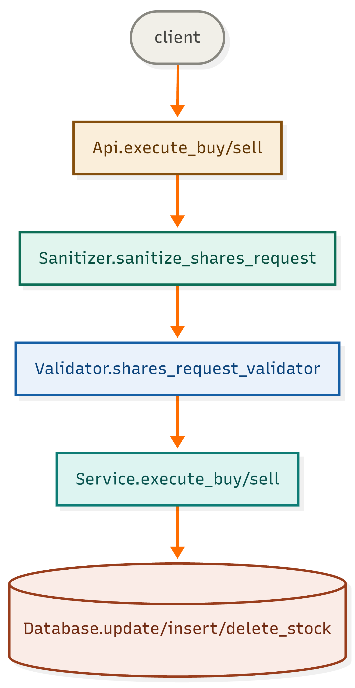

# EdgeXchange

A simulated investment platform for learning trading fundamentals. Build portfolios, execute trades, and observe how your picks perform under realistic market volatility — without the risk of real financial loss.

---

## Prerequisites

Before you begin, make sure the following are installed:

| Tool | Purpose | Download |
|---|---|---|
| Git | Clone the repository | https://git-scm.com/install |
| Node.js | Run the frontend | https://nodejs.org/en/download |
| uv | Python package manager | Installed in setup steps below |

---

## Setup

**1. Install uv**

Windows:
```powershell
powershell -ExecutionPolicy ByPass -c "irm https://astral.sh/uv/install.ps1 | iex"
```

Linux / Mac:
```bash
curl -LsSf https://astral.sh/uv/install.sh | sh
```

**2. Restart your terminal, then clone and run:**

```bash
git clone https://github.com/LoganOBerk/edgexchange.git
cd edgexchange/application/backend
uv sync
uv run edgexchange
```

**3. Open a second terminal in the repo directory and start the frontend:**

```bash
cd application/frontend
npm install next
npm run dev
```

Open http://localhost:3000 in your browser.

---

## Usage

Run the app with no flags for default behavior — an interactive CLI with database enabled and no artificial volatility.

```bash
uv run edgexchange
```

### Arguments

```
usage: edgexchange [-h] [-t] [-s] [-v %]

options:
  -h, --help   show this help message and exit
  -t, --test   sets program to testing mode
  -s, --serve  program is served on port 0.0.0.0:8000
  -v, --vol %  artificial volatility (percent)
```

| Flag | Description |
|---|---|
| `-t, --test` | Runs with a local test database instead of live data. Useful for development without affecting real accounts. |
| `-s, --serve` | Binds to all interfaces (`0.0.0.0`) on port `8000`, making the app accessible on your local network instead of the CLI. |
| `-v, --vol <percent>` | Injects artificial volatility into stock prices by the given percentage. E.g. `-v 5` adds ±5% variance. |

### Examples

```bash
# Default — CLI mode, live database, no volatility
uv run edgexchange

# Switch to web server instead of CLI
uv run edgexchange -s

# Development mode with test database and volatility
uv run edgexchange -t -v 10

# Serve on network with volatility for demos
uv run edgexchange -s -v 5
```

---

## System Architecture

<picture>
  <source type="image/svg+xml" srcset="diagrams/system-architecture.svg">
  
</picture>

### Database Architecture

<picture>
  <source type="image/svg+xml" srcset="diagrams/system-database.svg">
  
</picture>

---

## Feature Pipelines

Core feature pipelines with traversal through layers and main method calls excluding helper functions.

### Create Account
<picture>
  <source type="image/svg+xml" srcset="diagrams/system-pipelines-create-account.svg">
  
</picture>

### Find Account
<picture>
  <source type="image/svg+xml" srcset="diagrams/system-pipelines-find-account.svg">
  
</picture>

### Fund Account
<picture>
  <source type="image/svg+xml" srcset="diagrams/system-pipelines-fund-account.svg">
  
</picture>

### Create / Remove Portfolio
<picture>
  <source type="image/svg+xml" srcset="diagrams/system-pipelines-create_or_remove-portfolio.svg">
  
</picture>

### Execute Buy / Sell
<picture>
  <source type="image/svg+xml" srcset="diagrams/system-pipelines-execute_buy_or_sell.svg">
  
</picture>

---

## Program Documentation Guidelines

Fields marked **"if N/A – None"** must still appear with the literal value `None` so readers know the field was considered.

### Classes

```python
# PURPOSE:
#    - <ClassName> provides <X> abstraction
#    - <why the abstraction exists>
```

### Functions

```python
# INPUT: if N/A - None
#    - <param_name>(type); <what it represents>
# OUTPUT: if N/A - None
#    - <var_name>(type); <what it represents>
# PRECONDITION: if N/A - None
#    - <param_name or state>; <value constraint>
# POSTCONDITION: if N/A - None
#    - <param or state>; <observable guarantee after return>
# RAISES: if N/A - None
#    - <ExceptionType>; <condition that triggers it>
def function_name(param_name: type) -> type:
    return var_name
```

### Style Rules

| Rule | Description |
|---|---|
| **Semicolons** | Separate name/type from description with `"; "` |
| **Indentation** | Labels flush-left; entries indented with TAB |
| **Types** | Use Python builtins or `typing` module. Project-defined types listed in [Types](#types) below. Persistent types carry `id` (database primary key). Nested collections may be abbreviated in higher layers when element types are defined in a referenced `POSTCONDITION`. |
| **Constraints** | State value constraints, not types — `n > 0` not `"must be int"` |
| **Guarantees** | Describe observable state, not implementation details |
| **Be brief** | Short phrase per entry, not full sentences |

---

## Program Models

### Types

| Type | Description |
|---|---|
| `User` | Represents a user account; holds login, balance, and a collection of portfolios |
| `Portfolio` | Represents a named collection of stocks |
| `Stock` | Represents a stock holding; ticker and quantity |

### Request Models

JSON request bodies sent to the Frontend API.

**LogoutRequest**
```json
{
    "session_id": "string"
}
```

**CredsRequest**
```json
{
    "login": "string",
    "password": "string"
}
```

**FundsRequest**
```json
{
    "session_id": "string",
    "funds_requested": 0.00
}
```

**PortfolioRequest**
```json
{
    "session_id": "string",
    "name": "string"
}
```

**TransactionRequest**
```json
{
    "session_id": "string",
    "portfolio_name": "string",
    "ticker": "string",
    "quantity": 0
}
```

### Response Models

JSON response bodies returned by the Frontend API.

**StockData**
```json
{
    "ticker": "AAPL",
    "quantity": 4
}
```

**PortfolioData**
```json
{
    "name": "tech",
    "stocks": {
        "AAPL": { }
    }
}
```

> `stocks` values follow the `StockData` schema above.

**UserData**
```json
{
    "login": "john_doe",
    "balance": 1000.00,
    "portfolios": {
        "tech": { }
    }
}
```

> `portfolios` values follow the `PortfolioData` schema above.